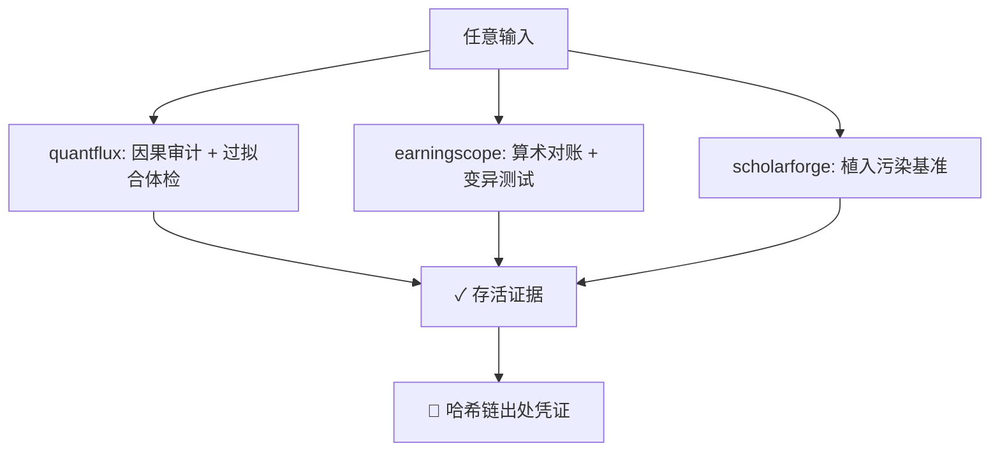

<h1 align="center">Wu503317</h1>

<b>Trust Layer Suite</b> — 让 AI 分析的每个结论：可验证 · 可审计 · 可复现

---

## 🧰 三件套

| 项目 | 一句话 | 核心亮点 |
|------|--------|----------|
| 🔭 [quantflux](https://github.com/Wu503317/quantflux) | 量化研究与回测引擎 | 结构性防未来函数 · 过拟合体检（PBO/DSR）· 对抗式因果审计 · 风险平价/无交易区间 |
| 📊 [earningscope](https://github.com/Wu503317/earningscope) | 财报智能分析（中英文） | 算术对账防幻觉 · 代数补全 · conformal 置信区间 · 引用式问答 |
| 📚 [scholarforge](https://github.com/Wu503317/scholarforge) | 学术文献综述平台 | Fellegi–Sunter 概率去重 · 主题边界 z 分数 · 一键综述 + BibTeX |

## 🏗️ 共同的算法身份：对抗式可信

每个组件的价值由它能存活的攻击来定义——

> 三个工具共享同一套统计学方法论（Fellegi 数据编辑 / 记录链接、随机化推断、conformal 预测），
> 从「我们用了正确的方法」升级为「我们攻击过自己，并公开存活的证据」。

## 🛠️ 技术栈

`Python 3.9+` · `numpy` · `FastAPI` · `零重依赖核心` · `ruff 双门禁` · `GitHub Actions CI` · `PEP 561 类型完备`

## 📈 当前状态

| 仓库 | 版本 | 测试 | CI |
|------|------|------|----|
| quantflux | v0.7.0 | 121 |  |
| earningscope | v0.5.0 | 90 |  |
| scholarforge | v0.6.0 | 98 |  |

---

项目私有研发中 · 演示与合作请通过 GitHub 联系

